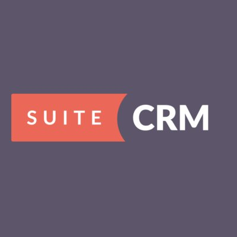

## suiteCRM

The JPS package deploys [suiteCRM](https://suitecrm.com/)  that initilly contains 1 application server and 1 database container.

### Highlights

This package is designed to deploy suiteCRM environment which automates your core sales, customer service and marketing processes.
It fuses simplicity, mobility, and social aspects of your app with the business process optimization of conventional CRM.

### Environment Topology

### Specifics

Layer                |     Server    | Number of CTs   by default | Cloudlets per CT   (reserved/dynamic) | Options
-------------------- | --------------| :----------------------------: | :---------------------------------------: | :-----:
AS                   | Apache 2 (MOD_PHP) |       1                        |           1 / 16                          | -
DB                   |    MySQL      |       1                        |           1 / 16                           | -

* AS - Application server 
* DB - Database 
* CT - Container

**suiteCRM Version**: 7.10.4 
**PHP Engine**: PHP 7.1.7 
**MySQL Database**: 5.7.19

## Deployment

# LICENSE

Licensed under GNU LGPLv3
